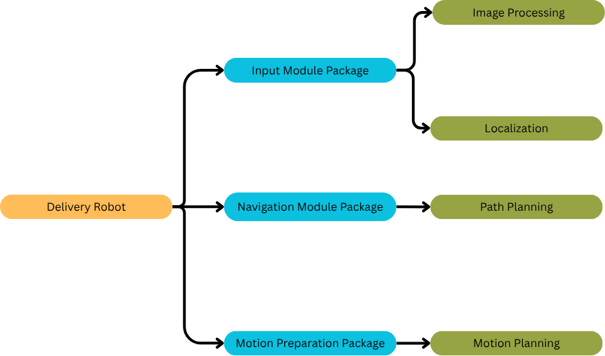
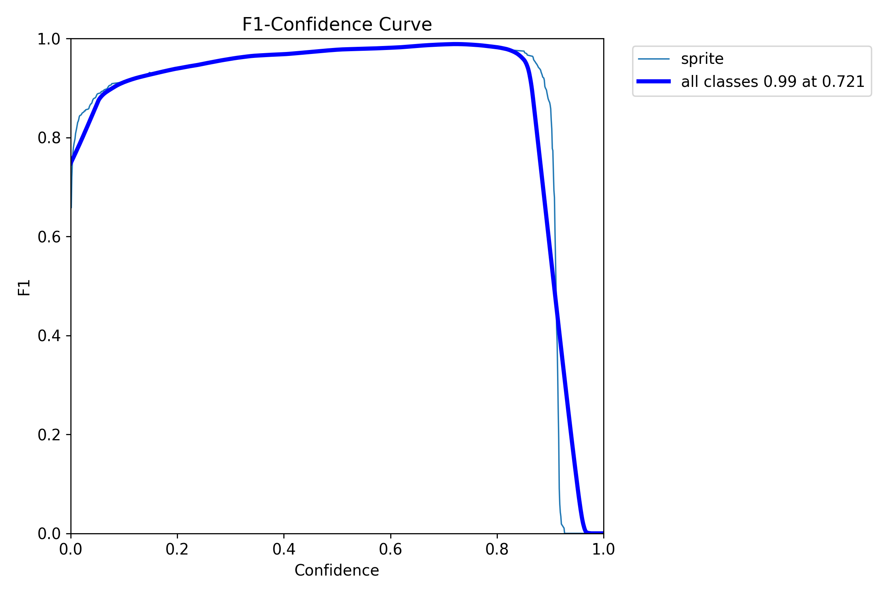

# Deliver Master: Indoor Restaurant Delivery Robot

## Overview
This project, developed as part of UofT course **MIE1077**, proposes an autonomous indoor restaurant delivery robot designed to address labour shortages and improve service quality in Canadian urban restaurants.  
The system integrates natural language understanding, action planning, object detection, navigation, and precise pick-and-place operations within a simulated 3D restaurant environment. This project is based on [pal-tiago robot](https://docs.google.com/presentation/d/1bCcY7AFAmbktMcgvld7WufuGaBtqRXFj/edit?usp=sharing&ouid=114492464970792931615&rtpof=true&sd=true), and all the packages and files in this repository are developed by RUIWU LIU independently apart from pal-tiago robot.

## Problem Statement
Growing restaurant demand in cities like Toronto and Vancouver requires efficient service solutions despite staffing constraints.  
Our robot enhances operational efficiency by autonomously handling routine delivery tasks, ensuring consistent guest experience.

## Key Features
- **Natural Language Understanding** – Interprets guest or staff commands (via typed text in simulation).  
- **Action Planning** – Converts high-level tasks into ordered action sequences.  
- **Object Detection** – Uses YOLOv11m CNN for real-time, robust object localization.  
- **Navigation** – Combines Nav2+SLAM for mapping with DWA for dynamic obstacle avoidance.  
- **Grasping & Placement** – Executes precise pick-and-place motions via imitation learning.

## System Architecture
The software consists of three main modules:
1. **Input Module Package** – GUI for text commands and camera feed; integrates YOLO detection and LLM-based parsing.  
2. **Navigation Module Package** – Global planner with local obstacle avoidance.  
3. **Motion Preparation Package** – Manual tele-operation and autonomous imitation learning modes.

## Results
- **Simulation Trials** – 50 runs with robust navigation, <16° yaw error, <0.12 m position error.  
- **Object Detection** – F1 Score ~0.99 at confidence threshold 0.72, reliable across wide confidence range.  
- **Imitation Learning** – Behavior Cloning (BC) converged rapidly; Inverse Reinforcement Learning (IRL) yielded effective policies for pick-and-place tasks.

## Technologies Used
- **Simulation**: Gazebo, SketchUp (environment design)  
- **Frameworks**: ROS2 (Nav2, SLAM), YOLO, LLM (ChatGPT-4.1-nano)  
- **Learning**: Behavior Cloning (BC), Inverse Reinforcement Learning (IRL)

## Assumptions
- Input commands via text (no microphone access in WSL VM).  
- Static 3D restaurant map (simulation only).  
- Fixed initial object placements (sprite cans) with support for relocation.  
- Supports both tele-operation and autonomous execution.

## Future Work
- Transition from simulation to real-world deployment.  
- Extend multi-object manipulation beyond sprite cans.  
- Integrate real voice command input.

## Demo Slides - Video Included
[Deliver Master Demo](https://docs.google.com/presentation/d/1bCcY7AFAmbktMcgvld7WufuGaBtqRXFj/edit?usp=sharing&ouid=114492464970792931615&rtpof=true&sd=true)

## To Use This Project
- Pull the code from [tiago-simulation](https://github.com/pal-robotics/tiago_simulation) and set up the environment according to its instructions, but stop before buiding the project. Please ensure that you are using ros2 humble and ubuntu 22.04. Otherwise, unexpected errors may occur.
- Move the folder 'input_module', 'motion_preparation', 'navigation_module', 'RestaurantModel' into src, as these folders are important packages used for controlling the robot that I wrote.
- Move the map files to '\src\tiago_simulation\tiago_multi\config'.
- Move the 'RestaurantModel' folder to '\src\pal_gazebo_worlds\models'
- Move the 'restaurant.world' file to '\src\pal_gazebo_worlds\worlds'
- Build the project with command specified in [tiago-simulation](https://github.com/pal-robotics/tiago_simulation).
- Launch the simulation with 'ros2 launch tiago_gazebo tiago_gazebo.launch.py navigation:=True moveit:=True is_public_sim:=True world_name:=restaurant'
---

### Authors
- **Ruiwu Liu**  

*Date: July 25, 2025*
